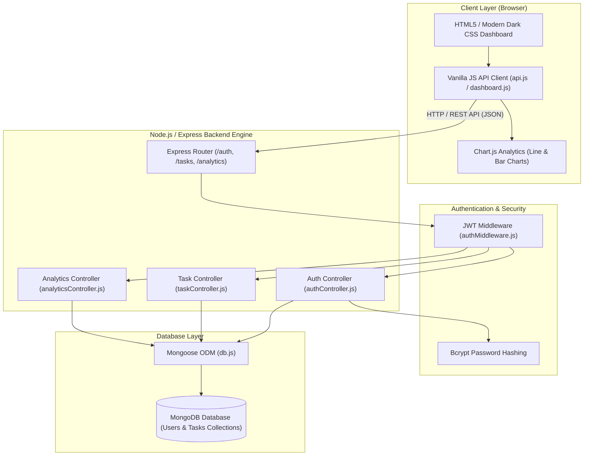
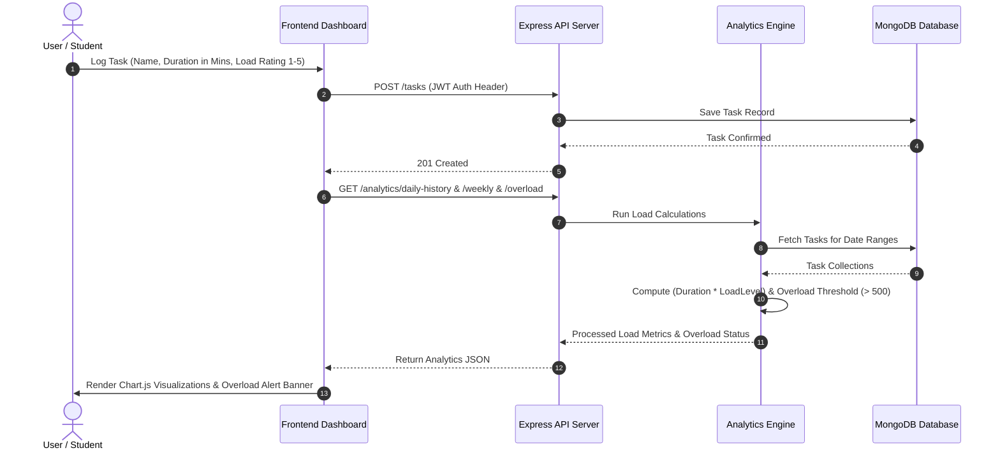

# 🧠 Cognitive Load Monitoring System

A full-stack web application designed to measure, track, analyze, and visualize daily mental workload and cognitive strain derived from user activities and tasks. Built with a Node.js/Express REST backend, MongoDB database, and a responsive Vanilla JavaScript single-page frontend powered by Chart.js.

---

## 📐 Architecture Diagram

### System Architecture
The application follows an **MVC (Model-View-Controller)** pattern with a decoupled RESTful API backend and a lightweight frontend client.



### Data & Analytics Flow


---

## ✨ Key Features

- **🔐 User Authentication**: Secure registration and login using JSON Web Tokens (JWT) and `bcryptjs` password hashing.
- **📝 Task Management**: Complete CRUD functionality to add, view, and delete daily tasks along with duration (minutes) and load rating (1 to 5 scale).
- **📊 Real-Time Analytics Engine**:
  - **Daily Cognitive Load**: Calculates total daily workload score based on server-side mathematical aggregation.
  - **7-Day Daily Load History**: Interactive line chart displaying load trends over the past week.
  - **4-Week Average Daily Load**: Bar chart illustrating weekly workload averages to identify long-term patterns.
  - **🚨 Automated Overload / Burnout Alert System**: Evaluates daily load against a critical threshold (`500` units/day). If cognitive load exceeds the threshold for **3 consecutive days**, the system triggers a prominent alert banner to mitigate burnout risks.
- **🌙 Modern Dark Theme UI**: Clean, aesthetic interface built with responsive HTML5/CSS3 and interactive Chart.js visualizations.

---

## 🧮 Cognitive Load Calculation Engine

The core cognitive load score for a given task is calculated on the server using the formula:

$$\text{Task Load} = \text{Duration (minutes)} \times \text{Load Level (1 to 5)}$$

### Aggregations & Thresholds:
- **Daily Total Load**: Sum of all task load scores recorded within a 24-hour period (midnight to midnight).
- **Weekly Average Load**: $\frac{\text{Total Load of Week}}{7}$ calculated across 4 preceding weeks.
- **Overload Condition**:
  ```javascript
  Daily Load > 500  (FOR 3 Consecutive Days)  =>  Trigger Burnout Alert
  ```

---

## 🛠️ Tech Stack

| Domain | Technology | Description |
| :--- | :--- | :--- |
| **Backend** | Node.js, Express.js | Event-driven web framework serving REST endpoints & static assets |
| **Database** | MongoDB, Mongoose | NoSQL document database with schema validation |
| **Frontend** | HTML5, Vanilla CSS3, JavaScript (ES6+) | Single-Page Dashboard Architecture |
| **Data Viz** | Chart.js | Responsive Canvas-based rendering for Line and Bar charts |
| **Security** | JWT, bcryptjs, CORS | Token-based auth, salted hashing, and cross-origin controls |
| **Environment** | dotenv | Environment variable management |

---

## 📁 Project Structure

```text
Cognitive-Load-Monitor/
├── backend/
│   ├── config/
│   │   └── db.js                 # MongoDB Mongoose connection config
│   ├── controllers/
│   │   ├── analyticsController.js # Analytics & overload logic engine
│   │   ├── authController.js      # User registration & login handlers
│   │   └── taskController.js      # Task CRUD handlers
│   ├── middleware/
│   │   └── authMiddleware.js     # JWT authorization middleware
│   ├── models/
│   │   ├── Task.js                # Task Mongoose schema definition
│   │   └── User.js                # User Mongoose schema definition
│   ├── routes/
│   │   ├── analyticsRoutes.js     # Analytics endpoints router
│   │   ├── authRoutes.js          # Authentication router
│   │   └── taskRoutes.js          # Task endpoints router
│   ├── .env                       # Backend environment variables
│   └── seed.js                    # Backend seeder script
├── frontend/
│   ├── css/
│   │   └── style.css              # Custom dark-theme styling & layout
│   ├── js/
│   │   ├── api.js                 # Centralized fetch API wrapper
│   │   ├── auth.js                # Login & Registration UI script
│   │   └── dashboard.js           # Dashboard UI state & Chart.js rendering
│   ├── dashboard.html             # Analytics dashboard view
│   ├── index.html                 # Login page view
│   └── register.html              # Registration view
├── package.json                   # Project dependencies and npm scripts
├── README.md                      # Detailed project documentation & architecture
├── seed_data.js                   # Root database seeder for 4-week sample data
└── server.js                      # Express server entry point
```

---

## 🔌 API Reference

### Authentication Endpoints
| Method | Endpoint | Auth Required | Description |
| :--- | :--- | :--- | :--- |
| `POST` | `/auth/register` | No | Register a new user (`username`, `email`, `password`) |
| `POST` | `/auth/login` | No | Authenticate user and return JWT token |

### Task Endpoints
| Method | Endpoint | Auth Required | Description |
| :--- | :--- | :--- | :--- |
| `GET` | `/tasks` | Yes (JWT) | Fetch all tasks logged by the authenticated user |
| `POST` | `/tasks` | Yes (JWT) | Create a task (`name`, `duration`, `loadLevel`) |
| `DELETE` | `/tasks/:id` | Yes (JWT) | Delete a specific task by ID |

### Analytics Endpoints
| Method | Endpoint | Auth Required | Description |
| :--- | :--- | :--- | :--- |
| `GET` | `/analytics/daily` | Yes (JWT) | Get cumulative cognitive load for today |
| `GET` | `/analytics/daily-history` | Yes (JWT) | Get daily load totals for the last 7 days |
| `GET` | `/analytics/weekly` | Yes (JWT) | Get 4-week historical weekly average daily load |
| `GET` | `/analytics/overload` | Yes (JWT) | Check if load exceeded 500 for 3 consecutive days |

---

## 🚀 Getting Started

### Prerequisites
- **Node.js** (v16.x or higher)
- **npm** (v8.x or higher)
- **MongoDB** instance (Local MongoDB server or MongoDB Atlas URI)

### Step 1: Clone Repository
```bash
git clone https://github.com/P-Sushanth/Cognitive_Load_Monitor.git
cd Cognitive-Load-Monitor
```

### Step 2: Install Dependencies
```bash
npm install
```

### Step 3: Configure Environment Variables
Verify or update the configuration in `backend/.env`:
```env
PORT=5000
MONGO_URI=mongodb+srv://<user>:<password>@cluster0.mongodb.net/cognitive-load-db
JWT_SECRET=supersecretkey123
```

### Step 4: Seed Demo Data (Optional)
To test the dashboard analytics with 4 weeks of historical task data and overload alerts:
```bash
node seed_data.js
```
*Demo Login Credentials created by seeder:*
- **Email**: `viva@demo.com`
- **Password**: `password123`

### Step 5: Run Server
```bash
npm start
```
The server will start at `http://localhost:5000`.

### Step 6: Access Dashboard
Open your browser and navigate to:
```text
http://localhost:5000
```

---

## 📄 License
This project is licensed under the [ISC License](LICENSE).
